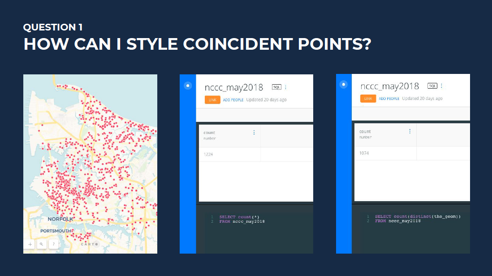
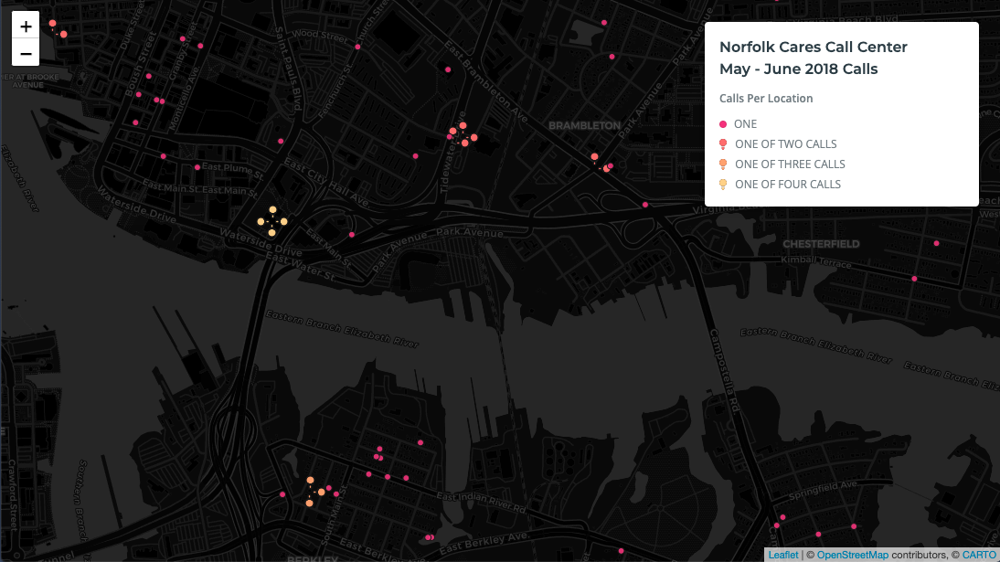

## Question 1
My map viewers can't tell they are looking at exactly-overlapping points. How can I style coincident points?

## Answer 
Spread out the markers for coincident points.

*credit: Mamata Akella's petal plots solution*

