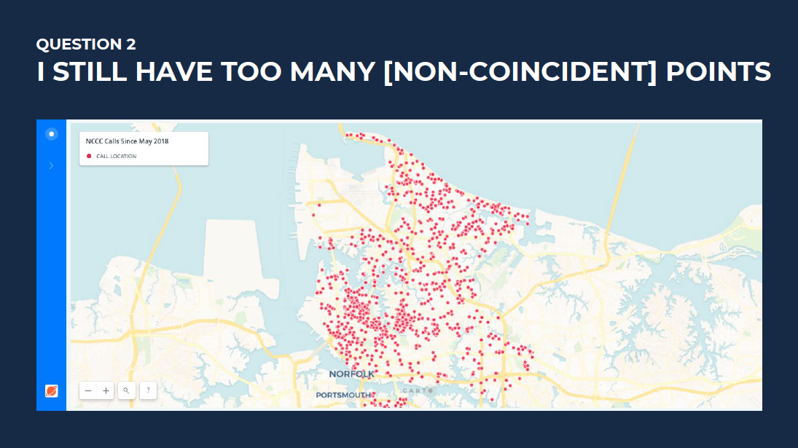
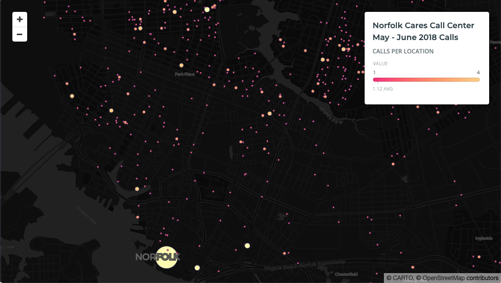

## Question 2
Even without coincident points, I still have too many overlapping points for my map viewers to pick out information.
How can I style overlapping points?

## Answer 
Aggregate the points into clusters. Code [here](https://github.com/ztephm/cartography-top5/blob/main/2-too-many-points/clusters.html).

