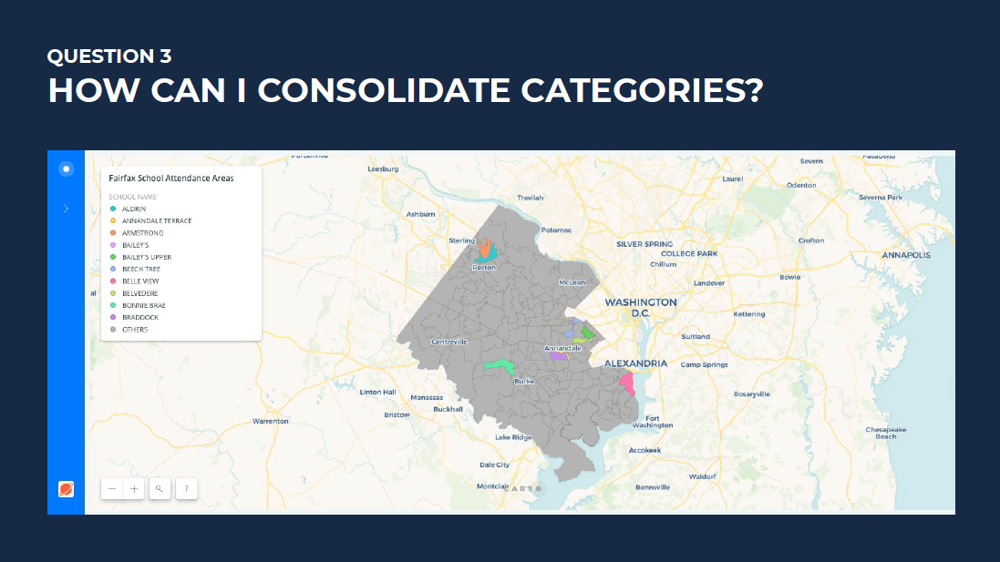
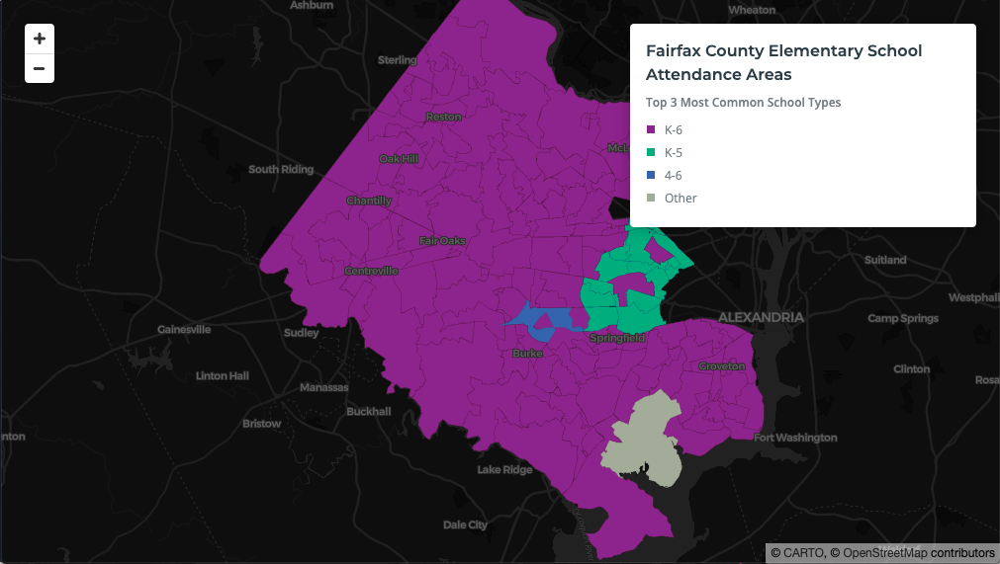

## Question 3
I want to make a Category Map, so I need to assign one color to each unique category. However, I have so many categories that it's hard to pick enough colors that are easily differentiated from each other.

## Answer 
Aggregate the categories. 

Use a [CARTO VL `top` expression](https://carto.com/developers/carto-vl/reference/#cartoexpressionstop) to automatically retrieve the top `n` most common values in your category column, and bin the rest into an "other" category. Code [here](https://github.com/ztephm/cartography-top5/blob/main/3-aggregate-categories/top-cats.html).

