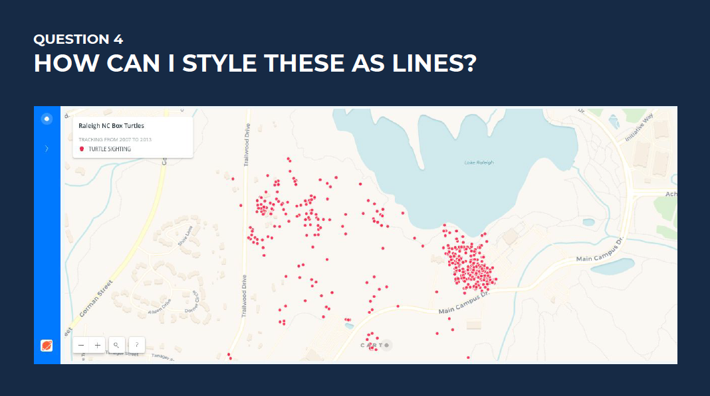
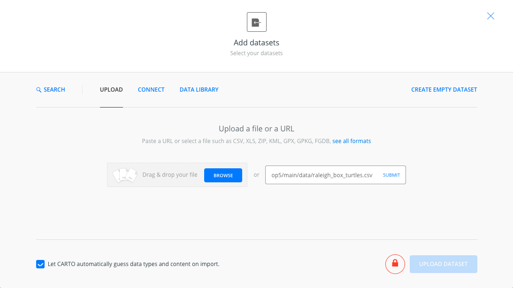
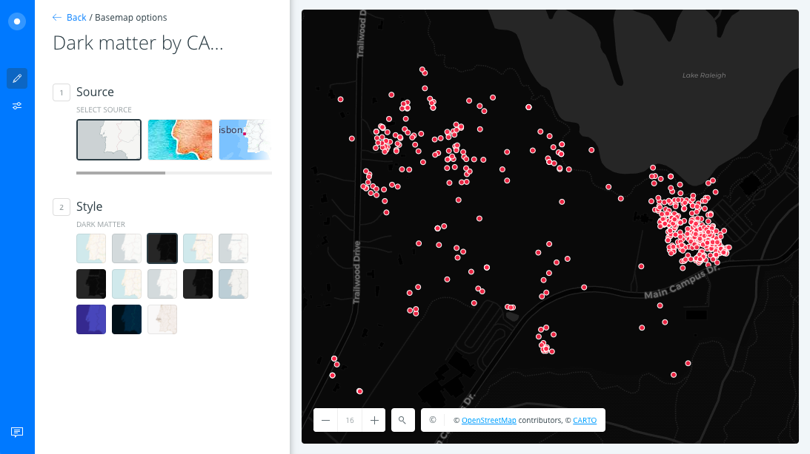
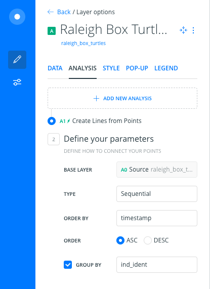
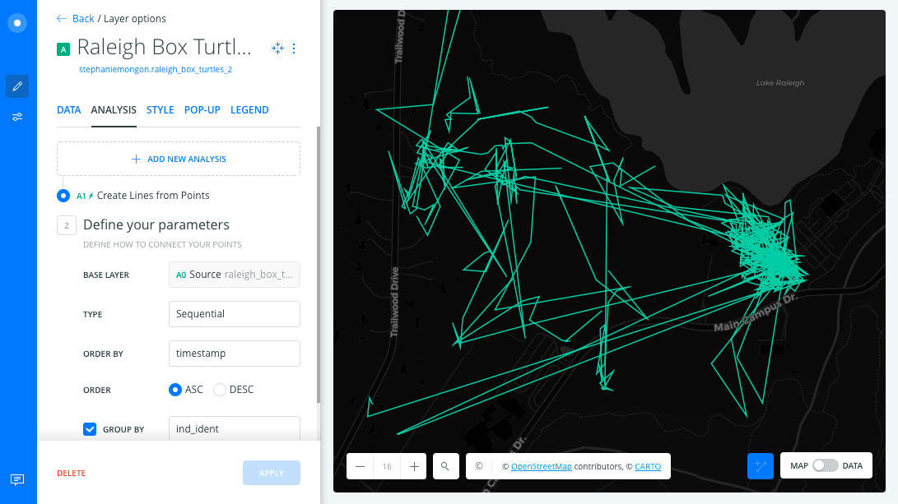
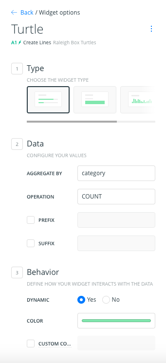
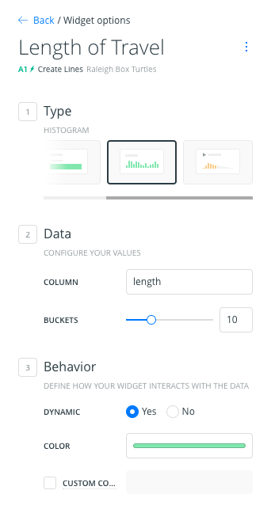
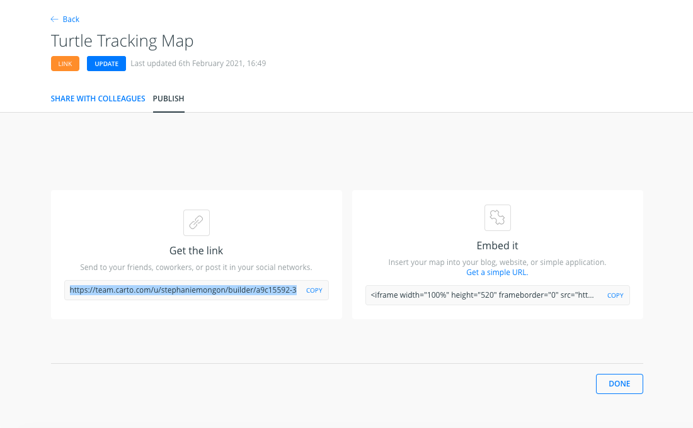
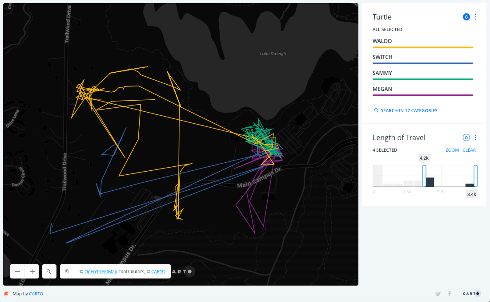

## Question 4
These points represent different locations of a few turtles over time. What's the best way to show a pattern in their movements?

## Answer 
Use [CARTO Builder](https://carto.com/builder/) analysis to create lines from points. Then use Builder widget autostyling to visualize each turtle's track.

### Create Lines from Points
We will use a dataset of animal observations. Each point in this dataset represents the location of a particular turtle at a certain time. 

#### Step 1: Import data
* Navigate to [this dataset](https://github.com/ztephm/cartography-top5/blob/main/data/raleigh_box_turtles.csv) & click the RAW button. Copy the the url in your browser tab's address bar. 
* Log into your CARTO account, then click Home dashboard's New map button. 
* In the next Add Datasets screen click Upload. Paste the url you copied into the Submit field and click Submit. 
* Select Never for Sync my data & click Upload Dataset.

*Resources*
* Guide: [How to import data in CARTO](https://carto.com/help/tutorials/import-data-guide/)

#### Step 2: Set up the map
* Rename the map: double-click on your map's title > edit it > click Enter/Return.
* Rename its layer: double-click on your map's non-basemap layer title > edit it > click Enter/Return.
* Change the basemap: click on the Basemap layer > select the first Dark Matter thumbnail in the Style section.

*Resources*
* Guide: [Intro to basemaps](https://carto.com/help/tutorials/intro-to-basemaps/)
* Guide: [List of available basemaps in CARTO](https://carto.com/help/building-maps/basemap-list/)
* Guide: [Inserting External Basemaps](https://carto.com/help/tutorials/inserting-external-basemaps/)

#### Step 3: Add analysis
The turtle dataset's `ind_ident` column contains the names of each turtle represented by a point on the map. We will use this column to group our points by turtle. For each turtle, we use the timestamp column to draw a line from its earliest location through its subsequent locations in order of time.

* Click on the map's non-basemap layer to open it > click on the Analysis tab.
* Click Add New Analysis > Select Create Lines from Points > click Add Analysis.
* Apply these settings:

Now your map should look like this:

*Resources*
* Guide: [Create Lines from Points](https://carto.com/help/tutorials/create-lines-from-points/)

#### Step 4: Add widgets
It's still hard to pick information out of all of these lines. We can make that easier by adding widgets. Builder widgets let map viewers filter features in the map view by their attributes.

*Add a Category Widget of turtle names*
* From the Analysis panel, click the Back button above the map layer's title.
* Click on the Widgets tab.
* Click Add New Widget > in the next Add new widgets screen make sure you are in the Category tab.
* Check the `category` box & make sure `A1 / Create Lines` node appears in the Select Layer box > click Continue.
* Double-click on the widget title > rename it > click Enter/Return.
* Use these widget settings:

This will create a widget that shows each turtle as a category. It displays a count of how many lines belong to each turtle. Since the analysis created one line (with multiple segments) for each turtle, the count is 1 for each category. 

*Add a Histogram Widget for length of travel*
* From the Category Widget settings panel, click the Back button above the map layer's title.
* Click Add New Widget > in the next Add new widgets click on the Histogram tab.
* Check the `length` box & make sure `A1 / Create Lines` node appears in the Select Layer box > click Continue.
* Double-click on the widget title > rename it > click Enter/Return.
* Use these widget settings:

This will create a widget that shows a bar chart representing the distances the turtles traveled in meters, broken into 10 buckets. You can roll over a bar to see how many turtles traveled within the distances represented by that bucket.

In the Widgets panel, you can click on a widget card and drag it to re-order the widgets.

*Resources*
* Guide: [Builder Widgets Overview](https://carto.com/help/tutorials/builder-widgets-overview/)
* Guide: [Understanding the Category Widget](https://carto.com/help/tutorials/understanding-the-category-widget/)
* Guide: [Understanding the Histogram Widget](https://carto.com/help/tutorials/understanding-the-histogram-widget/)

#### Step 5: Share this dashboard
The map dashboard we have created is shareable. To get a link that you can send to others:
* If your map's privacy is not already set to Public, click on the map's privacy label under the map title and select Public-With Link or Public.
* Click Publish.
* In the next screen, click Publish.

The shareable url can be copied from the `Get the link` section. 

*Resources*
* Guide: [Managing Map and Dataset Privacy](https://carto.com/help/tutorials/managing-map-and-dataset-privacy/)
* Guide: [Publishing and Sharing Maps](https://carto.com/help/tutorials/publishing-and-sharing-maps/)

#### Step 6: Use widgets for analysis
Widgets let us see insights from this dataset more clearly. We can use them to examine more than one attribute at a time.

When we make a selection in one widget, it filters some data out of the Map View. If widgets are set to be Dynamic, this means the other widget will automatically change also. That's because it will only show information for the features that were not filtered out of the Map View.

Let's find which turtles traveled the furthest.

* Click on the histogram widget and drag so the last two bars are selected.
  * This shows us which turtles traveled the furthest distance, based on the length of the lines that have been created by our analysis.
* Click on the teardrop icon in the Category Widget. 
  * A color will automatically be assigned to each category. This shows us each turtle's track on the map.

You can get this final map by navigating [here](https://github.com/ztephm/cartography-top5/blob/main/data/NACIS%204_%20Create%20Lines%20%2B%20Widgets%20copy%20(on%202021-02-07%20at%2000.07.18).carto) and clicking Download. The downloaded `.carto` file can be imported to your CARTO account by dragging/dropping it onto your Home dashboard.

*Resources*
* Guide: [Downloading and Importing CARTO maps](https://carto.com/help/tutorials/downloading-and-importing-carto-maps/)