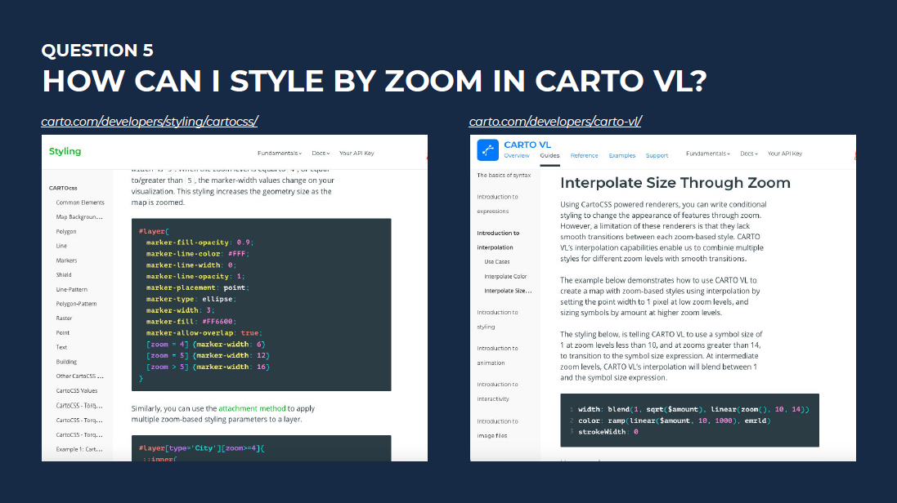
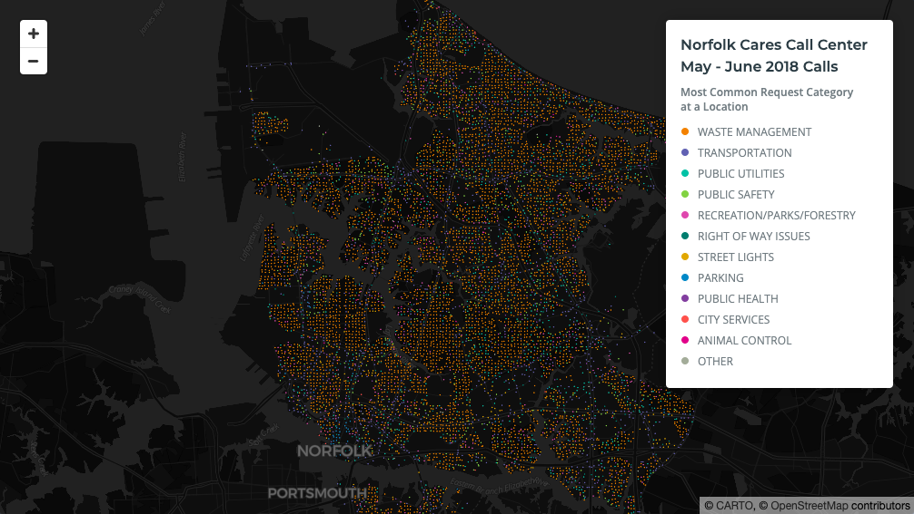
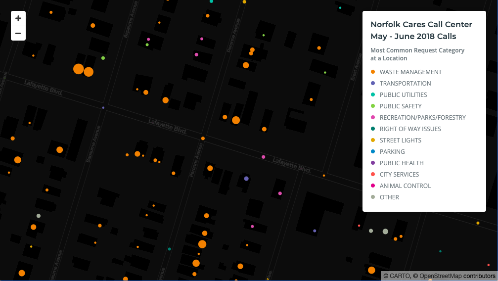

## Question 5
The styles appropriate for my map at one zoom level make the map unreadable at other zoom levels. What should I do?

## Answer 
Use different types of thematic cartography in the same map. Take advantage of [CARTO VL's WebGL rendering to change the map theme on the fly](https://carto.com/developers/carto-vl/guides/zoom-based-styles/) as viewers zoom in/out.

* Create a dot density map at small scale, since those zoom levels are an opportunity for viewers to see overall patterns in the data. 
* When viewers are zoomed into levels at which they can see more detail, create a proportional symbol map.

Code [here](https://github.com/ztephm/cartography-top5/blob/main/5-zoom-theme-change/dots-to-bins.html).

